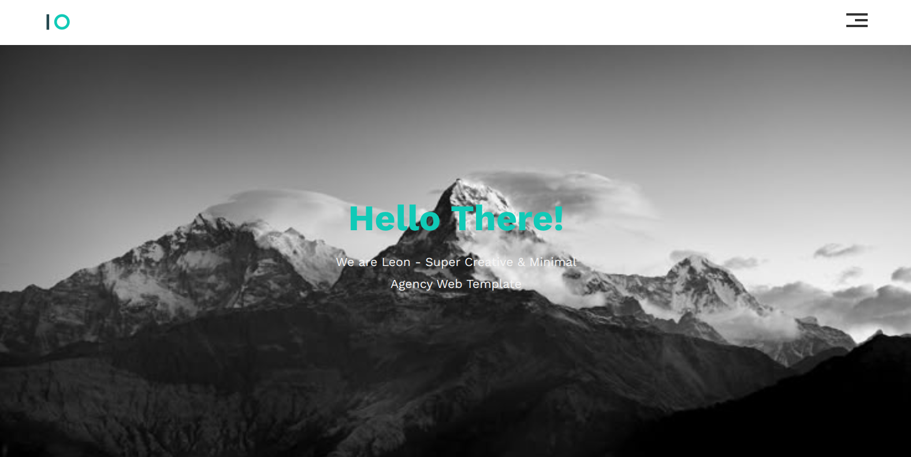

# Leon Agency Website Template

A modern, responsive single-page website template for creative agencies. Built with HTML5 and CSS3, featuring a clean and minimal design.



## Features

- **Responsive Design**: Fully responsive layout that works on all devices
- **Modern UI**: Clean and minimal interface with smooth interactions
- **CSS Grid & Flexbox**: Modern CSS layout techniques for better structure
- **Font Awesome Icons**: Integration with Font Awesome for scalable vector icons
- **Google Fonts**: Uses Work Sans font family for typography
- **Cross-browser Compatibility**: Includes normalize.css for consistent rendering across browsers

## Sections

1. **Header**: Navigation menu with responsive burger menu
2. **Landing**: Hero section with welcome message
3. **Features**: Highlight of key features with icons
4. **Services**: List of services offered with illustrations
5. **Portfolio**: Showcase of recent projects
6. **About**: Company information and details
7. **Contact**: Contact information and social media links

## Technologies Used

- HTML5
- CSS3
- Font Awesome (for icons)
- Google Fonts (Work Sans)
- normalize.css

## Setup

1. Clone the repository:
   ```bash
   git clone [repository-url]
   ```

2. Open `index.html` in your web browser

## File Structure

```
├── index.html              # Main HTML file
├── CSS/
│   ├── main.css           # Main stylesheet
│   └── normalize.css       # CSS reset/normalize
├── images/                 # Image assets
└── README.md              # Project documentation
```

## Customization

- Colors can be modified in the CSS variables in `main.css`:
  ```css
  :root {
      --main-color: #10cab7;
      --secondary-color: #314A70;
      --section-padding: 60px;
      --section-background: #f6f6f6;
  }
  ```

## Browser Support

- Chrome (latest)
- Firefox (latest)
- Safari (latest)
- Edge (latest)

## Credits

- Design by [Graphberry](http://www.graphberry.com)
- Images from [Unsplash](https://unsplash.com)
- Icons by [Font Awesome](https://fontawesome.com)
- Font by [Google Fonts](https://fonts.google.com)

## License

This project is licensed under the MIT License - see the LICENSE file for details.
